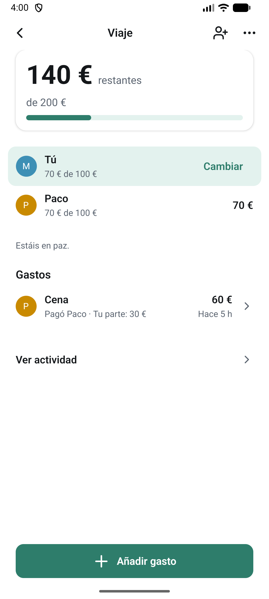
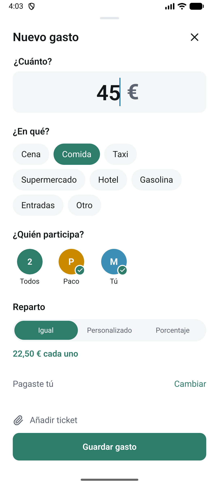
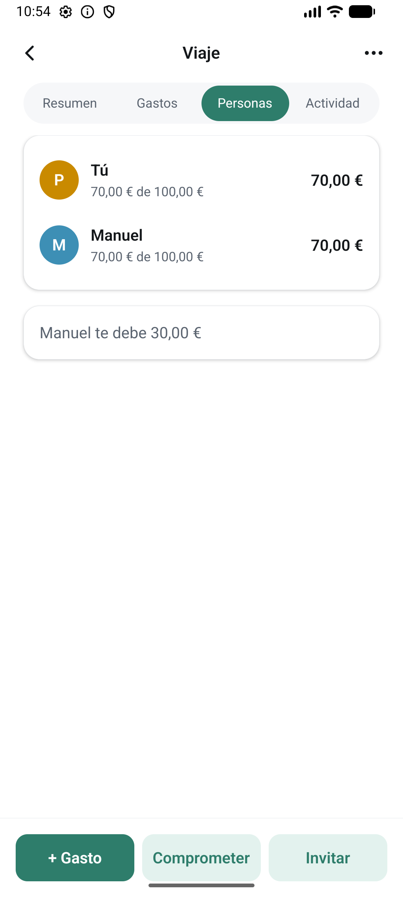

# Hucha

**Presupuestos y gastos compartidos, sin líos.**

Hucha es una aplicación móvil (iOS y Android) para organizar el dinero de un plan en
grupo: un viaje, una pareja, un piso compartido, una cena de amigos, un evento.

> Proyecto en desarrollo activo. Este repositorio es un escaparate público del proyecto;
> el código de producto se desarrolla en un repositorio privado.

## La idea

En la mayoría de apps de gastos compartidos primero se gasta y después se calcula quién
debe qué a quién. Hucha le da la vuelta:

1. Cada persona dice **cuánto pone** para el plan.
2. Cada gasto **va restando** de lo que cada participante ha comprometido.
3. El grupo ve siempre tres números: **comprometido · utilizado · restante**.

```
Viaje a Ibiza

Paco     100 €   Manuel   100 €   Franki   100 €     →  300 € comprometidos

Cena · 60 €  (pagó Paco, a partes iguales)

Paco      80 € restantes
Manuel    80 € restantes
Franki    80 € restantes                              →  240 € restantes
```

Nadie tiene que pensar en "deudas". Solo en cuánto queda.

## Qué hace hoy

- Registro en segundos con el número de teléfono (código de un solo uso).
- Crear una **hucha** e invitar a quien quieras con un enlace.
- Cada persona indica cuánto aporta.
- Añadir gastos: quién pagó, quiénes participan y cómo se reparte (a partes iguales,
  cantidades o porcentajes).
- **Participación selectiva**: puedes estar en la hucha y no participar en un gasto
  concreto.
- Resumen claro de la hucha, personas, gastos y actividad.
- Liquidación entre participantes (en la versión actual, **simulada** y claramente
  etiquetada como tal).

## Hacia dónde va

- Comprobantes: foto del ticket o recibo adjunto a cada gasto.
- Reparto por artículos individuales dentro de un mismo gasto.
- Liquidación al cierre de la hucha, minimizando el número de transferencias.
- Notificaciones cuando alguien se une, aporta o añade un gasto.
- Se están explorando futuras integraciones financieras para simplificar la liquidación
  de gastos. Hucha no custodia dinero ni almacena credenciales bancarias.

Detalle en [docs/ROADMAP.md](docs/ROADMAP.md) y estado en [docs/STATUS.md](docs/STATUS.md).

## Tecnología (a alto nivel)

- App móvil en **React Native con Expo** y TypeScript, una sola base de código para iOS y
  Android.
- API propia en **Node.js / TypeScript** sobre **PostgreSQL**.
- Toda la aritmética de dinero se hace con **enteros en céntimos**; nunca con decimales
  flotantes.

Más en [docs/TECH.md](docs/TECH.md).

## Capturas

| Resumen de una hucha                             | Nuevo gasto                                        | Personas                                     |
| ------------------------------------------------ | -------------------------------------------------- | -------------------------------------------- |
|  |  |  |

Capturas de la versión interna en desarrollo (emulador Android, datos de prueba).

## Principios

- **Sencillo antes que completo.** Cualquiera debe entenderlo sin tutorial.
- **Sin vocabulario financiero** en la interfaz: "has comprometido 50 €", "te quedan 37 €".
- **Privacidad por diseño.** Solo se guarda lo imprescindible.

---

_Hucha is a mobile app for shared budgets: everyone commits an amount up front, every
expense consumes part of each participant's commitment, and the group always sees
committed · used · remaining. Currently in development; this repository is a curated public
showcase._

© 2026 Hucha. Todos los derechos reservados. Ver [NOTICE.md](NOTICE.md).
