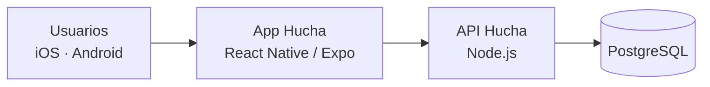

# Tecnología (visión general)

Descripción a alto nivel. Los detalles de implementación no forman parte de este
repositorio público.

| Capa | Elección | Por qué |
| --- | --- | --- |
| App móvil | React Native + Expo, TypeScript | Una base de código para iOS y Android; iteración rápida en dispositivos reales |
| Navegación | Expo Router | Rutas por archivos, enlaces profundos (invitaciones por enlace) |
| API | Node.js + TypeScript | Mismo lenguaje en todo el proyecto; contratos compartidos entre app y servidor |
| Base de datos | PostgreSQL | Transacciones fiables para todo lo que toca dinero |
| Dinero | Enteros en céntimos | Aritmética exacta; nunca decimales flotantes |
| Calidad | Tipado estricto, lint, tests automáticos e integración continua | Cada cambio se valida antes de integrarse |

## Principios de ingeniería

- Las reglas de negocio viven en un módulo puro y testeado, separado de la interfaz y de
  la API.
- Los importes derivados (utilizado, restante) se calculan siempre a partir de los hechos
  registrados; nunca se almacenan contadores que puedan descuadrarse.
- Seguridad y privacidad desde el diseño: datos mínimos, tokens en el almacenamiento
  seguro del sistema, sin credenciales bancarias.

## Esquema simplificado

